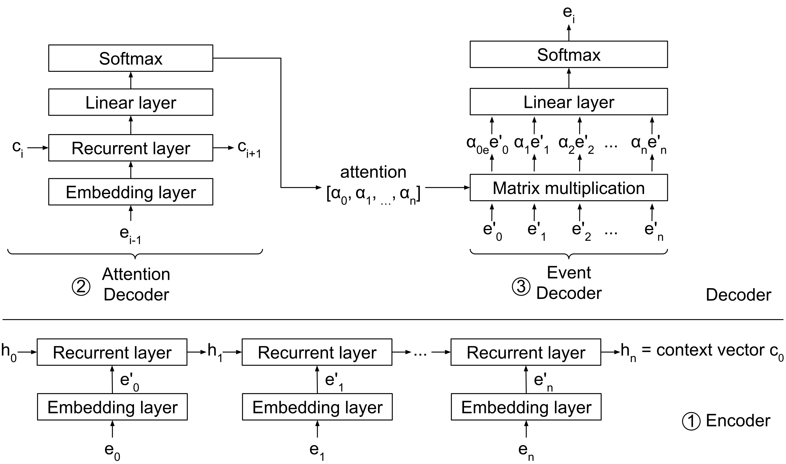

.. _ContextBuilder:

ContextBuilder
==============
The ContextBuilder is a `pytorch <https://pytorch.org/>`_ neural network architecture that supports `scikit-learn <https://scikit-learn.org/stable/>`_ like fit and predict methods.
The ContextBuilder is used to analyse sequences of security events and can be used to produce confidence levels for predicting future events as well as investigating the attention used to make predictions.

.. autoclass:: context_builder.ContextBuilder

The :py:meth:`context_builder.ContextBuilder.__init__` constructs a new instance of the ContextBuilder.
For loading a pre-trained ContextBuilder from files, we refer to :py:meth:`context_builder.ContextBuilder.load`.

.. automethod:: context_builder.ContextBuilder.__init__

Overview
^^^^^^^^

The ContextBuilder is an instance of the pytorch `nn.Module <https://pytorch.org/docs/stable/generated/torch.nn.Module.html>`_ class.
This means that it implements the functionality of a complete neural network.
Figure 1 shows the overview of the neural network architecture of the ContextBuilder.

    Figure 1: ContextBuilder architecture.

The components of the neural network are implemented by the following classes:

.. toctree::
   :maxdepth: 1

   decoder_attention
   decoder_event
   embedding
   encoder

These additional classes implement methods for training the ContextBuilder:

.. toctree::
  :maxdepth: 1

  loss
  optimizer

The ContextBuilder itself combines all underlying classes in its ``forward()`` function.
This takes the input of the network and produces the output by passing the data through all internal layers.
This method is also called from the ``__call__`` method, i.e. when the object is called directly.

.. automethod:: context_builder.ContextBuilder.forward

Fit/Predict methods
^^^^^^^^^^^^^^^^^^^
We provide the ContextBuilder as a classifier to learn sequences and predict the output values.
To this end, we implement `scikit-learn <https://scikit-learn.org/stable/>`_ like fit and predict methods for training and predicting with the network.

Fit
~~~
The ``fit()`` method automatically trains the network using the given input data ``X`` and ``y``, while allowing the user to set various learning variables such as the number of ``epochs`` to train with, the ``batch_size`` and ``learning_rate``.
Please see the method below for all available options.

.. automethod:: context_builder.ContextBuilder.fit

Predict
~~~~~~~
The ``predict()`` method outputs the ``confidence`` values for predictions of future events in the sequence and ``attention`` values used for each prediction.
The ``steps`` parameter specifies the number of predictions to make into the future, e.g. ``steps=2`` will give the next 2 predicted events to occur.

.. automethod:: context_builder.ContextBuilder.predict

Fit_predict
~~~~~~~~~~~
The ``fit_predict()`` method performs the ``fit()`` and ``predict()`` functions in sequence on the same data.

.. automethod:: context_builder.ContextBuilder.fit_predict

Query
^^^^^
The ``query()`` method implements the `attention query` from the DeepCASE paper.
This method tries to find the optimal attention vector for a given input, in order to predict the known output.

.. automethod:: context_builder.ContextBuilder.query

I/O methods
^^^^^^^^^^^
The ContextBuilder can be saved and loaded from files using the following methods.
Please note that the :py:meth:`context_builder.ContextBuilder.load` method is a ``classmethod`` and must be called statically.

.. automethod:: context_builder.ContextBuilder.save

.. automethod:: context_builder.ContextBuilder.load

**Example:**

.. code:: python

   from deepcase.context_builder import ContextBuilder
   builder = ContextBuilder.load('<path_to_saved_builder>')
   builder.save('<path_to_save_builder>')
