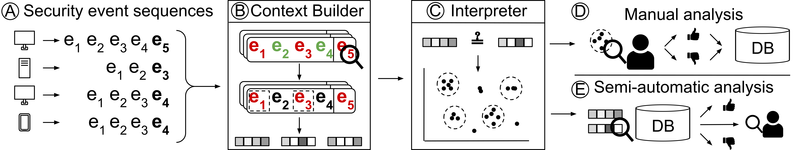

Overview
========
This section gives a high-level overview of the different steps taken by DeepCASE to perform a contextual analysis of security events and explains how DeepCASE clusters events to reduce the workload of security analysts.

1) `Event sequencing`_

2) `Context Builder`_

3) `Interpreter`_

4) `Manual Analysis`_

5) `Semi-automatic Analysis`_

    Figure 1: Overview of DeepCASE.

Event sequencing
^^^^^^^^^^^^^^^^
The first step is to transform events stored in your local format into a format that DeepCASE can handle.
For this step, we use the :ref:`Preprocessor` class, which is able to take events stored in a ``.csv`` and ``.txt`` format and transform them into DeepCASE sequences.
For the required formats for both the ``.csv`` and ``.txt`` files, we refer to the :ref:`Preprocessor` reference.

Context Builder
^^^^^^^^^^^^^^^
Next, DeepCASE passes the sequences to the  :ref:`ContextBuilder`.
When receiving sequences, the :ref:`ContextBuilder` first applies its :py:meth:`fit()` method to train its neural network.
Once the network is trained, we use the :ref:`ContextBuilder`'s  :py:meth:`predict()` method to get the ``confidence`` in each event with its context and ``attention`` for all events in the context.
These ``confidence`` and ``attention`` values can then be passed to the :ref:`Interpreter` together with the ``events`` and their ``context`` for clustering.

.. figure:: ../_static/architecture.png

    Figure 2: Architecture of DeepCASE's Context Builder.

Interpreter
^^^^^^^^^^^
The main task of the :ref:`Interpreter` is to take sequences (consisting of ``context`` and ``events``) and cluster them.
To this end, the :ref:`Interpreter` invokes the :ref:`ContextBuilder`'s :py:meth:`predict()` method and applies the :py:meth:`attention_query()` to obtain a vector representing each sequence.
These vectors are then used for clustering.
Afterwards, clusters can be manually analysed and assigned a score.
After assigning a score to existing clusters, the :ref:`Interpreter` can compares new ``context`` and ``events`` to existing clusters and assign the scores (semi-)automatically.
For sequences that cannot be assigned automatically, the :ref:`Interpreter` gives an output indicating why a sequence could not be assigned automatically.

Manual Analysis
^^^^^^^^^^^^^^^
In manual mode, we use the :py:meth:`interpreter.Interpreter.cluster()` method to cluster sequences consisting of ``context`` and ``events``.
This method returns the cluster corresponding to each input, or ``-1`` if no cluster could be found.

Next, we can manually assign scores using the :py:meth:`interpreter.Interpreter.score()` function.
This function takes a score for each clustered sequence and assigns it to the corresponding clusters such that these scores can be used for predicting new sequences.

.. Note::

   The :py:meth:`interpreter.Interpreter.score()` function requires:
    1. that all sequences used to create clusters are assigned a score.
    2. that all sequences in the **same** cluster are assigned the **same** score.

   If you do not have labels for all clusters or different labels within the same cluster, the :py:meth:`interpreter.Interpreter.score_clusters()` method prepares scores such that both conditions are satisfied.

Semi-automatic Analysis
^^^^^^^^^^^^^^^^^^^^^^^
In semi-automatic mode, we use the :py:meth:`interpreter.Interpreter.predict()` method to assign scores to new sequences (``context`` and ``events``) based on known clusters.
It will either assign the score of the given cluster or a score of:

 * ``-1``, if the :ref:`ContextBuilder` is not confident enough for a prediction.
 * ``-2``, if the ``event`` was not in the training dataset.
 * ``-3``, if the nearest cluster is a larger distance than ``epsilon`` away from the sequence.
